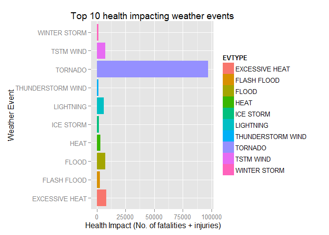
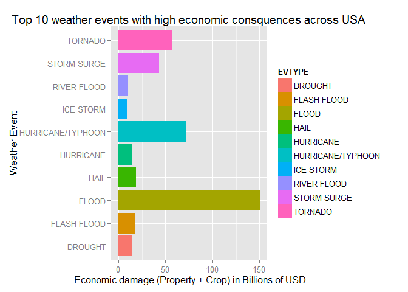

# Weather events - Human health & economic impact in USA
  
Wednesday, September 20, 2014  

## Title 
The impact of severe weather events in United States in terms of human health as well as economic damage is analyzed and presented in this report 


## Synopsis
This project involves exploring the U.S. National Oceanic and Atmospheric Administration's (NOAA) storm database. This database tracks characteristics of major storms and weather events in the United States, including when and where they occur, as well as estimates of any fatalities, injuries, and property damage. Based on the analysis below are the major findings.

1. **Tornado** is the most human health impacting weather event in terms of fatalities and injuries that counted to about **96979** people till day in US.
2. Execessive heat, TSTM wind, floods, lighting are the next top 4 human health impacting weather events.
3. **Floods** are identified as the top weather event that did an economic damage of about **15.3** Billion dollars.
4. The next 4 high impacting weather events are: Hurricane/Typhoon, Tornado and Storm Surge.
 

## Data Processing

There are a number of steps involved in data processing that are briefed below step by step.

####1. Data Download
The data from the NOAA Storm Database that is considered for this analysis.  The data is in a compressed file that has been downloaded from URL: "https://d396qusza40orc.cloudfront.net/repdata%2Fdata%2FStormData.csv.bz2"; stored locally and uncompressed for processing.


```r
rm(list = ls()) ## Clean local environment so that no stale data exists
### Fetch Data
## verify data directory exits. If not create one.
if (!file.exists("data")) { dir.create("data")}

## Download data from URL if data does not exists already.
dataSourceURL <- "https://d396qusza40orc.cloudfront.net/repdata%2Fdata%2FStormData.csv.bz2"

if (!file.exists("data/StormData.csv.bz2") || !file.exists("data/StormData.csv")){
    download.file (dataSourceURL, destfile ="./data/StormData.csv.bz2", cacheOK = FALSE)
    
    install.packages("R.utils")  ## install package if it doesnt exist before.
    library(R.utils)
    ## Unzip the file to get the data.
    bunzip2("./data/StormData.csv.bz2", destname = "./data/StormData.csv", remove=FALSE, overwrite=T)  
}
```

####2. Cleaning Data
Quick look at the downloaded data reveals that the weather events are provided in a column.  And a deeper look at this column reveals that the weather events have been classified to a very detailed level and sub levels that sometimes seems to be wrong for us.  However, as this data is from NOAA, the following assumptions are considered for simplification of Data Analysis.
**Assumptions:**
1. All the event type classification present in NOAA data base is considered as is and correct.
2. No spell check or changes will be done for weather even type.
3. Spaces before and after event type are not considered.
4. Missing data is not considered.
5. The validness or correctness of event location such as city, count, state and others will not be looked into and corrected in this analysis.


```r
require(data.table, quietly=TRUE) ## install the package if doesn't exist
originalRawData <- read.csv("./data/StormData.csv", as.is = TRUE, strip.white = T, sep=",")
rawDT<- data.table(originalRawData)
trim <- function (x) gsub("^\\s+|\\s+$", "", x)   ## Remove white spaces
rawDT$EVTYPE <- trim(rawDT$EVTYPE)  ## There are few event types with white spaces. Hence, remove them.
```

####3. Computing to analyze event types that are most harmuful with respect to Population Health
The raw data does not giving direct information about what's the population health.  However, the data about **fatalities** as well as **injuries** per weather event type is provided.

Combining fatalities and injuries per each weather event will help us to analyze and find which **type of weather events are more harmful with respect to population health***. The entire data for all over unitied states will be considered and categorized in terms of event types.


```r
## 1.Across the United States, which types of events (as indicated in the EVTYPE variable) are most harmful with respect to population health?
rawDT$HEALTH <- rawDT$FATALITIES + rawDT$INJURIES
healthPerEvent <- rawDT[!is.na(HEALTH), sum(HEALTH), keyby=EVTYPE]
summary(healthPerEvent)
```

```
##     EVTYPE                V1       
##  Length:977         Min.   :    0  
##  Class :character   1st Qu.:    0  
##  Mode  :character   Median :    0  
##                     Mean   :  159  
##                     3rd Qu.:    0  
##                     Max.   :96979
```

As you can see from the above *summary* information, that there are about 977 different event types classification and they are unordered. Firstly, the data should be ordered with the event type having highest health impact on top to the lowest.  And to prioritize and have better focus over the high impacting events, **TOP 10** weather events will be considered for representaion.


```r
orderHealth <- healthPerEvent[order(healthPerEvent$V1, healthPerEvent$EVTYPE, na.last=NA, decreasing = T)]
topHealth <- orderHealth[1:10]
setnames(topHealth, c("EVTYPE", "HEALTH"))
head(topHealth)
```

```
##            EVTYPE HEALTH
## 1:        TORNADO  96979
## 2: EXCESSIVE HEAT   8428
## 3:      TSTM WIND   7461
## 4:          FLOOD   7259
## 5:      LIGHTNING   6046
## 6:           HEAT   3037
```

    

####4. Computing to analyze which types of events have greatest economic consequences in USA.
The data set consists of two columns named *'PROPDMG' and 'CROPDMG'* that represent the 'property damage' and 'crop damage' respectively.  Combining these two columns will give the total cost damage per event which shows the economic impact.

However, there are two other columns 'PROPDMGEXP' and 'CROPDMGEXP' which convey the units of each of the damages are represented in 'K (thousands)', 'Millions' or 'Billions'.

. Property damage units used are in column 'PROPDMGEXP' are **K, M, , B, m, +, 0, 5, 6, ?, 4, 2, 3, h, 7, H, -, 1, 8 **
. Crop damage units used are in column 'CROPDMGEXP'are **'r unique(rawDT$CROPDMGEXP)' **

As the damage cost is represented in different units, the first step is to convert all the data in to one unit. Converting all data into Billions will give us a better persepective of the economic impact of each event types. The conversion logic will consider M/m as Millions, B/b as billions and everything else as K - thousands. The below will help with this conversion are done.

##### 4.1. Converting all Property damages costs into Billions.

```r
rawDT$PROPDMGBillions <- rawDT$PROPDMG

## Converting Millions to Billions
mil <- grepl("[Mm]", rawDT$PROPDMGEXP, ignore.case = T)
rawDT$PROPDMGBillions[mil] <- rawDT$PROPDMG[mil]/1000

## Convering K - Thousands to Billions.
kilo <- !grepl("[BbMm]", rawDT$PROPDMGEXP, ignore.case = T)
rawDT$PROPDMGBillions[kilo] <- rawDT$PROPDMG[kilo]/1000000
```

##### 4.2. Converting all Crop damages costs into Billions.

```r
rawDT$CROPDMGBillions <- rawDT$CROPDMG

## Converting Billions to Millions
mils <- grepl("[Mm]", rawDT$CROPDMGEXP, ignore.case = T)
rawDT$CROPDMGBillions[mils] <- rawDT$CROPDMG[mils]/1000

## Convering K - Thousands to Billions.
kilos <- !grepl("[BbMm]", rawDT$CROPDMGEXP, ignore.case = T)
rawDT$CROPDMGBillions[kilos] <- rawDT$CROPDMG[kilos]/1000000

rawDT$ECO <- rawDT$PROPDMGBillions + rawDT$CROPDMGBillions
```

##### 4.3. Computing Top 10 economic damage.
The total economic cost is computed by combining Property cost and crop damage cost.  Ordering 

```r
ecoPerEvent <- rawDT[!is.na(ECO), sum(ECO), keyby=EVTYPE]
summary(ecoPerEvent)
```

```
##     EVTYPE                V1        
##  Length:977         Min.   :  0.00  
##  Class :character   1st Qu.:  0.00  
##  Mode  :character   Median :  0.00  
##                     Mean   :  0.49  
##                     3rd Qu.:  0.00  
##                     Max.   :150.32
```

As you can see from the above *summary* information, there are about 977 different event types classification and they are unordered. Firstly, the data will be ordered with the event type having highest economic impact on top to the lowest.  And to prioritize and have better focus over the high impacting events, **TOP 10** weather events will be considered for representaion.


```r
orderECO <- ecoPerEvent[order(ecoPerEvent$V1, ecoPerEvent$EVTYPE, na.last=NA, decreasing = T)]
topECO <- orderECO[1:10]
topECO$V1 <- round(topECO$V1, digits = 2)
setnames(topECO, c("EVTYPE", "DAMAGE"))
head(topECO)
```

```
##               EVTYPE DAMAGE
## 1:             FLOOD 150.32
## 2: HURRICANE/TYPHOON  71.91
## 3:           TORNADO  57.35
## 4:       STORM SURGE  43.32
## 5:              HAIL  18.76
## 6:       FLASH FLOOD  17.56
```
.


## Results
Answers to the 2 question are presented below as graphs showing the TOP 10 events that have higher impact on human lives, health and economic damage across USA

**Answer to Question 1: Across the United States, which types of events (as indicated in the EVTYPE variable) are most harmful with respect to population health?**

The below graph & table represents the ** Top 10 ** health impacting weather events in United states.  The number of lifes impacted by each of these events are also listed in the graph. 


By far the effect of **Tornado** is quite significant in terms of human health (fatalities and injuries). The next is 'Excessive Heat', Wind and so on.  Please refer to below table for the top 10 list as well as the number of fatalities and injuries caused by each of these weather events.


```r
library(ggplot2)
qplot(EVTYPE, HEALTH, data=topHealth, fill = EVTYPE, geom = "bar", stat = "identity", 
      xlab = "Weather Event", ylab = " Health Impact (No. of fatalities + injuries)", 
      main = "Top 10 health impacting weather events") + coord_flip() 
```

 

*NOTE*: To make the event names easily readable/legible, the event types is represented on the plot over Y-axis. (Picking event type in x-axis is making labels overwrite on each other due to the orientation).


```r
topHealth
```

```
##               EVTYPE HEALTH
## 1            TORNADO  96979
## 2     EXCESSIVE HEAT   8428
## 3          TSTM WIND   7461
## 4              FLOOD   7259
## 5          LIGHTNING   6046
## 6               HEAT   3037
## 7        FLASH FLOOD   2755
## 8          ICE STORM   2064
## 9  THUNDERSTORM WIND   1621
## 10      WINTER STORM   1527
```

**Question 2: Across the United States, which types of events have the greatest economic consequences?**

The below graph and table represents the ** Top 10** types of events that have greatest economic consequences in USA. 

The graph shows that the economic damage done by **FLOOD** events is way higher than other weather events with estimated damage of '**$150.32 billions**'. Hurricane/Typhoon, Tornado and storm surge comes later. Please refer to the table below for the list of top 10 weather events and the estimated damages they caused in billions of US dollars.


```r
qplot(EVTYPE, DAMAGE, data=topECO, fill = EVTYPE, geom = "bar", stat = "identity",
      xlab = "Weather Event", ylab = " Economic damage (Property + Crop) in Billions of USD", 
      main = "Top 10 weather events with high economic consquences across USA") + coord_flip()
```

 


```r
topECO
```

```
##               EVTYPE DAMAGE
## 1              FLOOD 150.32
## 2  HURRICANE/TYPHOON  71.91
## 3            TORNADO  57.35
## 4        STORM SURGE  43.32
## 5               HAIL  18.76
## 6        FLASH FLOOD  17.56
## 7            DROUGHT  15.02
## 8          HURRICANE  14.61
## 9        RIVER FLOOD  10.15
## 10         ICE STORM   8.97
```
